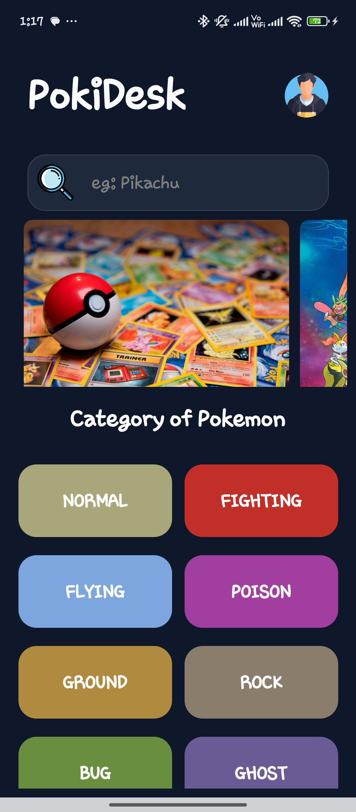
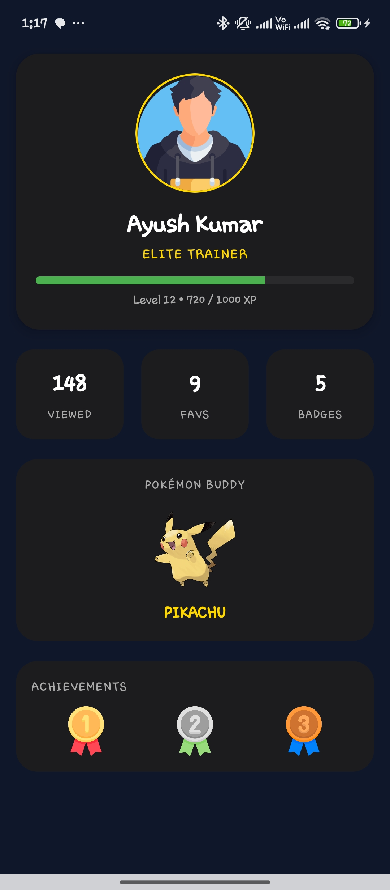
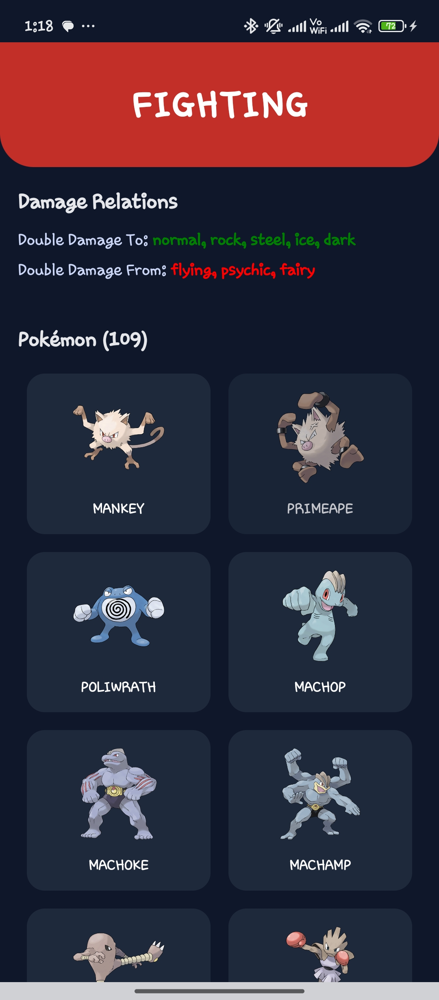
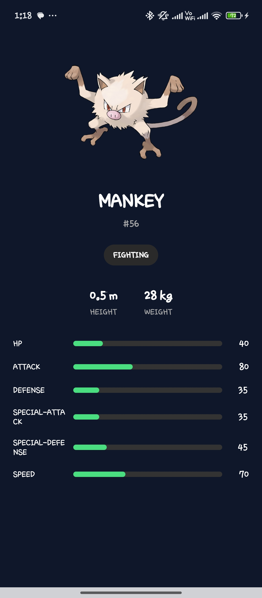

# PD Components (src/PD)

This folder contains the PD (Pokémon Desk) feature screens and related UI assets used by the app.

## Screenshots & Video

A small gallery of recent screenshots and a recording from the app (files are in the `ScreenShots` folder).

- Video (tap the thumbnail to open the recording):

<a href="ScreenShots/Screenrecorder-2026-01-23-01-25-32-918.mp4">
  
</a>


- Screenshots:







If you'd like a different thumbnail for the video or a specific ordering/grouping of screenshots, tell me which image(s) to prefer and I'll update the gallery.

## Overview

- Location: `src/PD`
- Purpose: encapsulate the PD screens, small UI views, and assets used by the PD feature set.

## Components

- `src/PD/screens/Home.jsx` — Main PD home screen; entry point for PD features and navigation hub.
- `src/PD/screens/PicDraw.jsx` — Drawing / picture editor screen used for annotations and sketches.
- `src/PD/screens/PokemonProfile.jsx` — Detailed view for a single Pokémon profile.
- `src/PD/screens/PokimonGridViews.jsx` — Grid/list view presenting multiple Pokémon items.
- `src/PD/screens/Profile.jsx` — User profile or PD-related profile screen.

## Utilities & Assets

- `src/PD/utils/ColorScheme/` — Centralized color tokens and theme helpers.
- `src/PD/utils/Icons/` — Icon components and exports used across PD screens.
- `src/PD/utils/Images/` — Image references and helpers for static assets.

## Usage / Import Examples

Basic import pattern for a screen:

```
import Home from '../PD/screens/Home';

// inside navigator
<Stack.Screen name="PDHome" component={Home} />
```

Reference an image or icon from PD utils:

```
import { Images } from '../PD/utils/Images';
import Icon from '../PD/utils/Icons/IconName';

<Image source={Images.logo} />
<Icon name="star" size={24} />
```

Navigation notes:
- Most PD screens expect a `navigation` prop from React Navigation; use `navigation.navigate('RouteName', params)` to open details.

Props conventions:
- Screens receive route params via `route.params`.
- UI components follow standard React Native props (style, onPress, source, etc.).

## Development & Running

- To run the app locally (from workspace root):

```
npm install
npm run android
# or
npm run ios
```

- Edit PD screens in `src/PD/screens` and assets in `src/PD/utils`.

## Contributing / Notes

- Keep components small and focused; prefer composition over large monolithic screens.
- Follow the color tokens in `ColorScheme` for consistent theming.
- If adding images, place them in `src/PD/utils/Images` and export them from the index file.

## Where to find related code

- App navigation: check `src/screens/TabNav.jsx` and the global screens to see where PD screens are mounted.
- Shared components: search `src/components` (if present) for reusable UI pieces.


